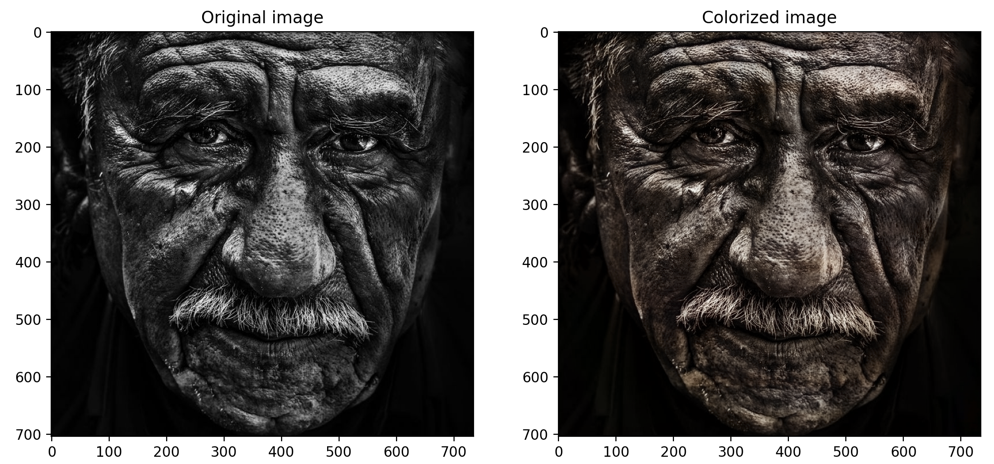
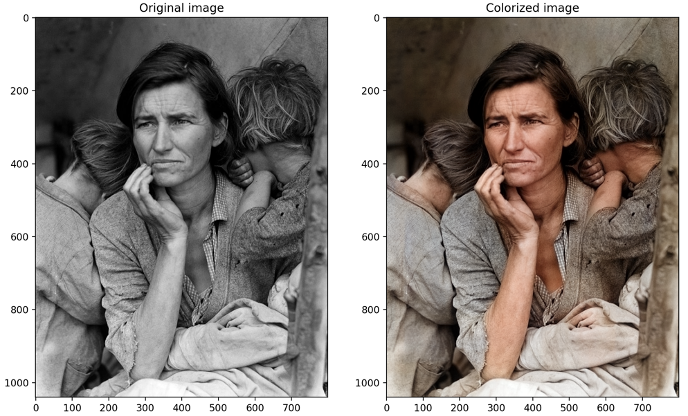

# Colorization CoreML

This is a repository for image colorization using CoreML.
The model is based on the [Colorful Image Colorization](https://arxiv.org/abs/1603.08511) paper and
the original GitHub [repository](https://github.com/richzhang/colorization).
The model used in this repository is named `siggraph17`.




## Installation

1. Create a virtual environment:
```shell
virtualenv -p python3.9 .venv && source .venv/bin/activate
```
2. Install all requirements:
```shell
pip install -r requirements.txt
```
3. Use the project :tada:

## Usage

To run use command below:
```shell
python run_colorization.py --data-root images
```

If an image is not in black and white, it will be converted to black and white before colorization.
It's worth noting that the model inference will only work on MacOS due to restrictions of the coremltools framework.
## Models

The first model, [colorizer_core.mlmodel](weights/colorizer_core.mlmodel), expects a PIL.Image named `image_small`
with a size of (3, 256, 256).
It returns an array containing `colorized_small_image`, an A and B values from the LAB color space (2, 256, 256).

Afterward, you need to resize `colorized_small_image` to the original image size, convert this array to PIL.Image.
Let's name the result `ab`.

The second model, [colorizer_tail.mlmodel](weights/colorizer_tail.mlmodel), requires the original PIL.Image,
`image`, of any size, as well as the `ab` (i.e., the resized `colorized_small_image` from the previous model).
This model returns an array containing the colorized image, `colorized_image`, of the original size.

## Built With

* [coremltools](https://github.com/apple/coremltools) - The NNs inference framework used
* [OpenCV](https://opencv.org/) - Images processing framework used
* [Pillow](https://pillow.readthedocs.io/) - Images processing framework used
* [Typer](https://typer.tiangolo.com/) - CLI framework used


## License

This project is licensed under the MIT License - see the [LICENSE](LICENSE) file for details

## Authors

* **Vadim Titko** aka *Vadbeg* -
[LinkedIn](https://www.linkedin.com/in/vadtitko) |
[GitHub](https://github.com/Vadbeg)
